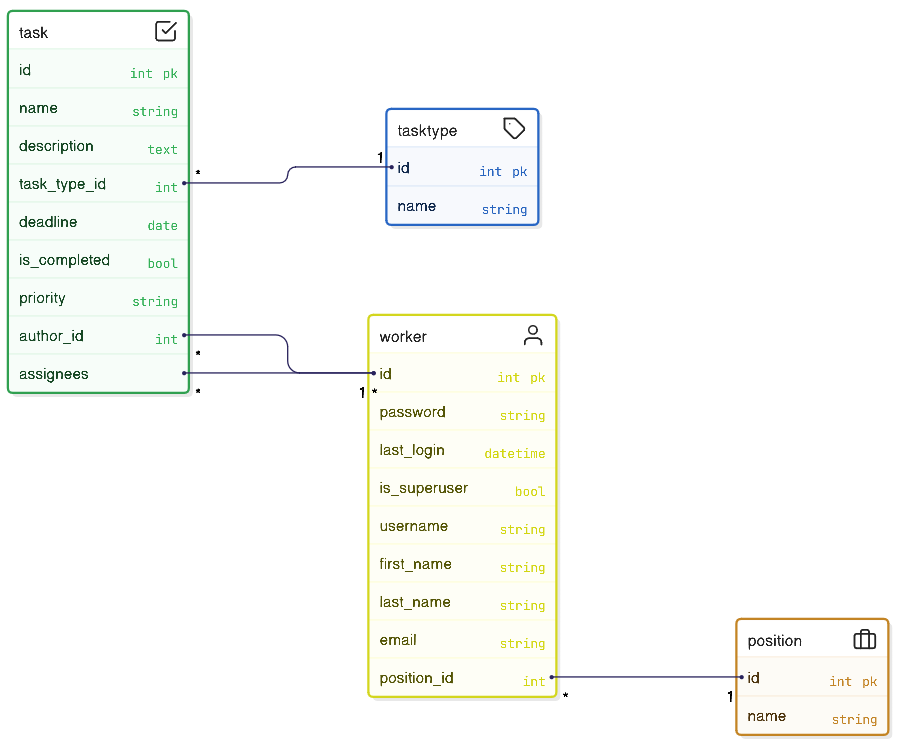
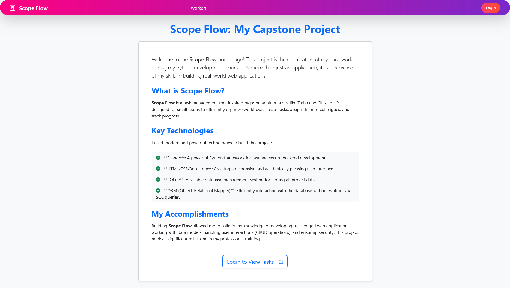
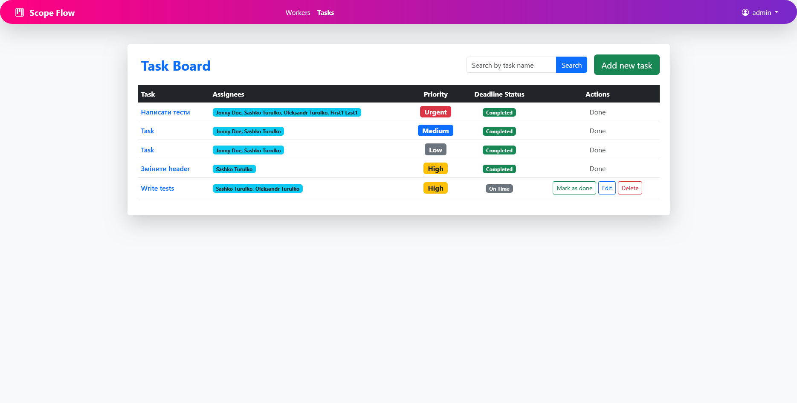
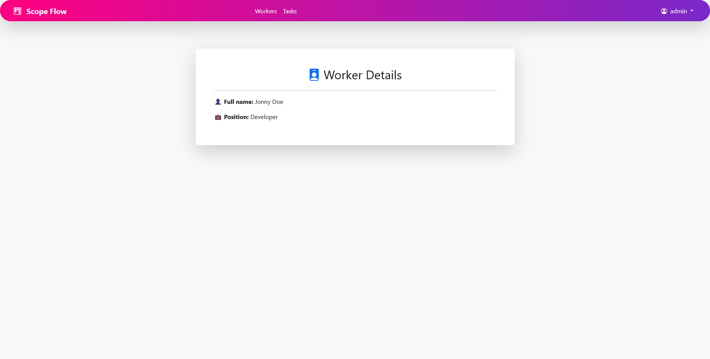
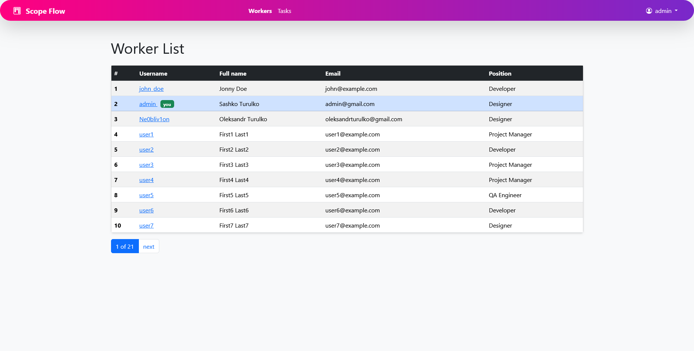

# Scope Flow

**Scope Flow** is a learning Django project focused on practicing full-stack development: models, authentication, CRUD operations, clean UI, and well-structured code.

---

##  Project Goal

This project was built as a learning case — to implement basic CRUD functionality, authentication, user (worker) and task management, and task types, while also working on clean UI, solid architecture, and Django best practices.  
See [Pull Request #2](https://github.com/turulko-oleksandr/scope-flow/pull/2).

---

##  Features

- **Models**: Worker, Task, Position, TaskType  
- **Admin Panel**: integrated models into Django Admin  
- **Authentication**: register, login, logout, protected pages  
- **CRUD**: create, view, update, and delete tasks and workers  
- **UI**: clean design, template structure with blocks, homepage, pagination, search  
- **Tests**: basic view tests for functionality checks  
- **.env**: sensitive data (e.g., SECRET_KEY) stored in `.env` (ignored by Git)  

---
## Data structure

The project was built based on the following database design:  



It consists of four main models:  

- **Worker (User)** – represents the system users.  
- **Position** – defines the role or job title of a worker.  
- **Task** – stores information about assigned tasks.  
- **Task Type** – categorizes tasks into different types.  

##  UI Screenshots

- Home Page


 
- Task Board 



- Task Info



- Worker List




---

##  Quick Start

```bash
# Clone repository
git clone https://github.com/turulko-oleksandr/scope-flow.git
cd scope-flow

# Create and activate virtual environment
python -m venv venv
source venv/bin/activate         # Linux/macOS
venv\Scripts\activate            # Windows

# Install dependencies
pip install -r requirements.txt

# Prepare .env file based on example
cp .env.example .env
# Edit .env and add your settings, for example:
# SECRET_KEY=your-secret-key

# Apply migrations
python manage.py migrate

# (Optional) create superuser
python manage.py createsuperuser

# Run server
python manage.py runserver
